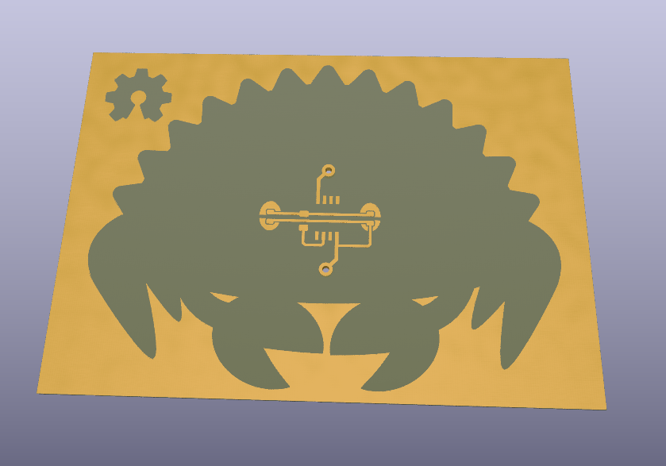

# pcb



# pcb etching

- [https://diode.zone/w/k4zDYAxCuDqSCyeibGYn9w](https://diode.zone/w/k4zDYAxCuDqSCyeibGYn9w)
- [https://git.sr.ht/~jleightcap/ferris-quine-hw](https://git.sr.ht/~jleightcap/ferris-quine-hw)
- [https://git.sr.ht/~jleightcap/ferris-quine-rs](https://git.sr.ht/~jleightcap/ferris-quine-rs)

# embedded rust

- rust is cool
- powerful type system
- compile time computation
- memory safety
- immutability by default, `unsafe`

# embedded rust: type system

what might be *data* in C can be encoded as *types*,

```C
// data, may be erased at compile time
static uint8_t Port = _BV(PB3);
// the clock frequency is actually a macro
// -D_CPU_FREQ=8000000
static uint32_t Clock = ...;
```

as

```rust
type Port = PB3;
type Clock = clock::MHz8;
```

# embedded rust: type system
then used for compile-time computation,
```rust
let tick: u8 = match Clock {
	clock::MHz8 => 6,
	clock::MHz1 => 48,
}
```

but not limiting if using generics,

```rust
type Port = ...;

fn led_init<Port>(l: Port) {
	...
}
led_init<Port>();
```

# embedded rust: type system

or even if some functionality is limited to some subset type,

```rust
fn adc_read<Port>(p: Port)
where
	Port: ADCPort // <- traits
{
	...
}


```


changing `Port` type only effects type-level representation

# embedded rust: type system

mutability as ~type, how is that a *value* `tick` used?

```rust
let tick = ...;
tick += 2; // <- this will not compile

// but we want to change tick!
// explicitly annotated as mutable
let mut tick = ...;
tick += 2; // fine
```

this is the opposite of how C/C++ work!

```C
void init(const int a, const char * b, short c[]) {
	// what can be mutated here?
}
```

`const` annotations are entirely optional

# embedded rust: approach to global memory

```c
static LED *led;

void timer() {
	led->blink();
}

void main() {
	timer_init();
	*led = LED();
	for(;;)
		;
}
```

how can this fail?

# embedded rust: approach to global memory
```rust
static LED: avr_device::interrupt::Mutex<
    RefCell<Option<avr_hal_generic::port::Pin<
		Output, Port>>>>
= avr_device::interrupt::Mutex::new(RefCell::new(None));
```

- this is quite verbose, can use *type inference*
- two generic, made concrete as `Output` for `Port`
- `Mutex` is a lock, prevent the data race in C example
- `RefCell` is a "mutable pointer"
- `Option`, can be `Some(led)` or `None`

# embedded rust: approach to global memory

how do you actually use that?

```rust
let mut led: Pin<Output, PB3> = pins.pb3.into_output();
led.set_low();

// can't be interrupted
avr_device::interrupt::free(|cs| {
  *LED.borrow(cs).borrow_mut() = Some(led);
});
```

# embedded rust: approach to global memory

then in that interrupt context,

```rust
#[avr_device::interrupt(attiny85)]
fn TIMER0_OVF() {
    static mut ILED:
		Option<avr_hal_generic::port::Pin<Output, Port>>
	= None;
    if let Some(led) = ILED {
        led.toggle();
    } else {
        avr_device::interrupt::free(|cs| {
            ILED.replace(LED)
                .borrow(cs)
                .replace(None)
                .unwrap());
        })
    }
}
```

# embedded rust: approach to global memory

- this is extremely verbose, but;
- the LED is "moved", no one outside of the interrupt can touch it
- no undefined accesses to LED

# embedded rust: safety

rust's killer feature imho

```rust
fn timer_init(tc0: attiny_hal::pac::TC0) {
    tc0.tccr0a.write(|w| w.wgm0().ctc());
	// this can fail, and that's explicitly clear!
	// this will not compile without marking as unsafe
    tc0.ocr0a.write(|w| unsafe { w.bits(TIMER_COUNTS) });
    tc0.tccr0b.write(|w| w.cs0().prescale_1024());
    tc0.timsk.write(|w| w.ocie0a().set_bit());
}
```

# embedded rust: summary

cons

- i didn't talk about it but the tooling is *very* immature
- i had to hack on the HAL *a lot*
- the ideas here can be quite foreign
- "what's all this noise about `Mutex` or whatever just give me a pointer!!"
- embedded C/C++ are not going away, why rust?

pros

- embedded rust is the first time ideas from theoretical computer science have trickled down to the lowest levels of programming
- these ideas totally eliminate large classes of bugs that are common in embedded systems
- C/C++ FFI (not mentioned here but very cool)
- embedded rust is the future !! (opinion)

note, i'm not a rust evangelist, it has its fair share of problems as well!

# quines

> A quine is a computer program which takes no input and produces a copy of its own source code as its only output.

# quines

```C
#include<stdio.h>
int main(void) {
  printf("#include<stdio.h>\nint main(void){\nprintf(");
}
```

uh hold on what comes next?
this needs to print itself.
let's try something more recursive

# quines

```C
#include<stdio.h>
int main(void) {
  char *s="#include<stdio.h>\nint main(void) {\n";
  printf(s); printf("char *s=\"%s\"",s);
}
```

which produces

```
#include<stdio.h>
int main(void) {
  char *s="#include<stdio.h>\nint main(void) {"
```

closer!
having some *data* representing the code is a good approach.
how do we print the rest?

# quines

we've uncovered some kind of general structure,

```C
prelude
char *interlude = "text";
postlude
```

and we want to do something like

1. print `prelude`
2. print `interlude`, where we have some weird self-reference thing going on?
3. print `postlude`

# quines

```C
#include <stdio.h>
int main(void) {
  char *s="prelude" "char *s=" "postlude");
  printf(s up to the '=');
  printf(all of s);
  printf(s after the '=');
}
```


# quine

```C
#include <stdio.h>

int main(void) {
  char *s="\
#include <stdio.h>\n\
int main(void) {\n\
  char *s=\n\
  printf(damn, s);\n\
  printf(damn, s);\n\
  printf(damn, s + 46);\n\
}";
  printf("%.47s", s);
  printf("%s", s);
  printf("%s", s + 46);
}
```

# quine
```
#include <stdio.h>

int main(void) {
  char *s=
#include <stdio.h>\n\
int main(void) {\n\
  char *s=\n\
  printf(damn, s);\n\
  printf(damn, s);\n\
  printf(damn, s + 46);\n\
};
  printf(damn, s);
  printf(damn, s);
  printf(damn, s + 46);
}
```

# quine

*escaping* is hard!
one solution: don't, just use characters

- need to print `"`? `putchar(34)`
- need to print `\n`? `putchar(10)`

now this is married to ASCII

# quine: embedded rust

for same structure as above, with the data offset at 229 characters in,

```Rust
S.chars().take(229).for_each(|c| u8blink(c as u8));
S.chars().for_each(|c| {
	u8blink(34);
	u8blink(c as u8);
	u8blink(34);
});
S.chars().skip(229).for_each(|c| u8blink(c as u8));
```

# result

- etched PCB with rust logo
- rust for firmware on that pcb
- leds blinking the rust source code
